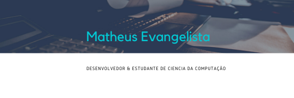

<h1 align="center">Hi there, i'm Tardis AKA Matheus Evangelista 👋</h1>
<h2 align="center">I'm a dev and computer science student!!</h2>

I love to code and to create new things, i like challenges and to be able to do them as it fit me,
	i love puzzles and games like tetris,CSGO and playing basketball.

> **My OS**  						

**🔭 I’m currently working on ...**
- My mom's website
- Some other java projects to train
- My own portfolio

**🌱 I’m currently learning and have interest in...**
- 
- 
- 

**👯 I’m looking to collaborate on ...**
- Literally anything 😄 

**📫 How to reach me: ...**
- Email : matheus_santos_evangelista@hotmail.com

<!--
**Tardis2001/Tardis2001** is a ✨ _special_ ✨ repository because its `README.md` (this file) appears on your GitHub profile.

Here are some ideas to get you started:

- 
- 🤔 I’m looking for help with ...
- 💬 Ask me about ...
- 
- 😄 Pronouns: ...
- ⚡ Fun fact: ...
-->
